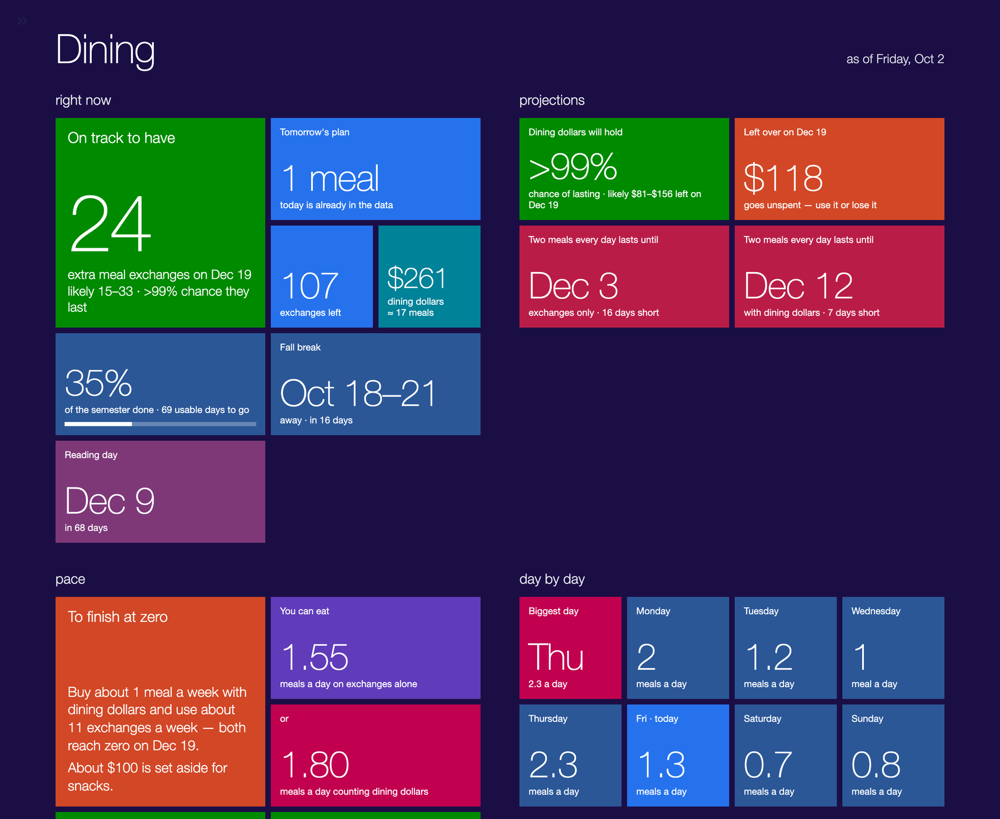
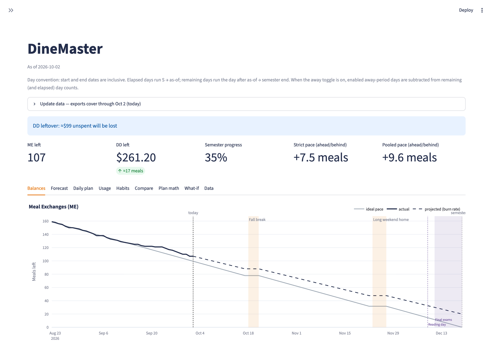
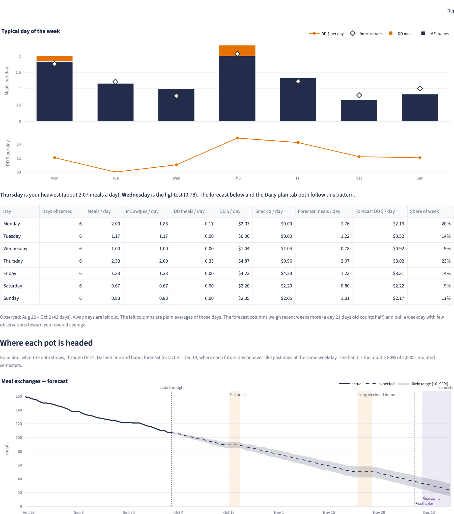
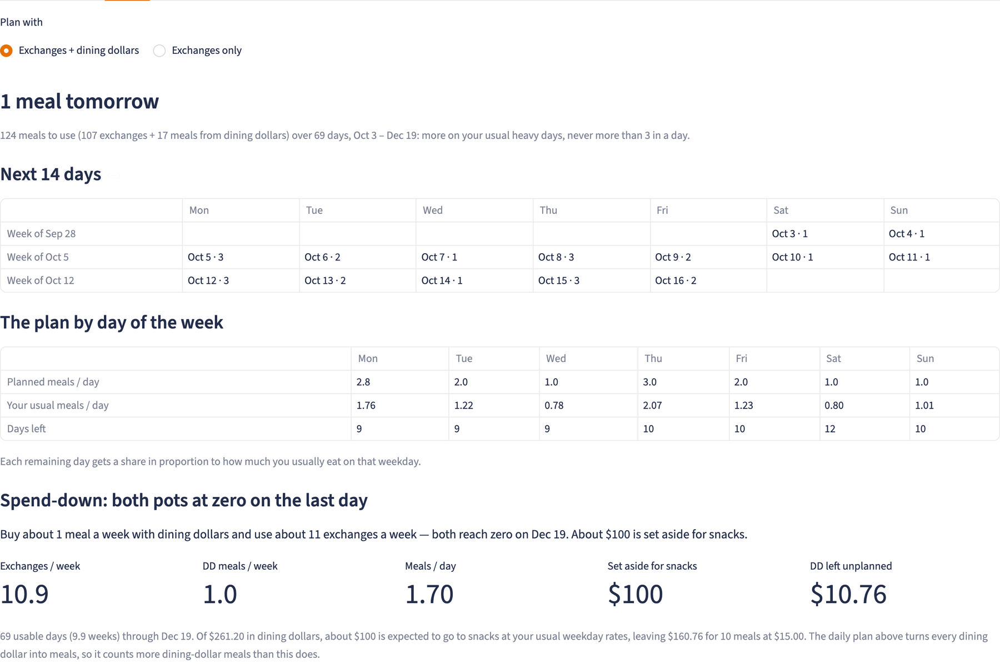
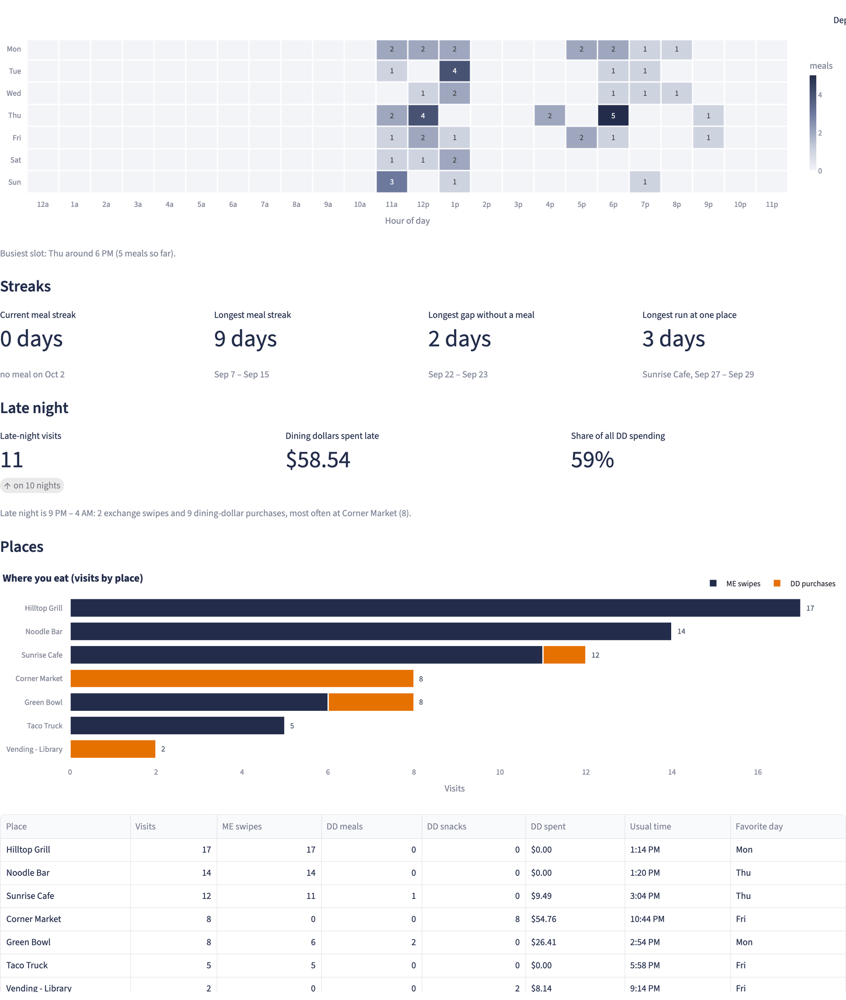

# DineMaster

A dashboard that runs on your own computer and answers one question: **will my dining plan last the semester?**

This is overkill, and that's on purpose. You can answer that question with the balance on the dining website and thirty seconds of division. DineMaster answers it with nine tabs, a 2,000-run simulation, a heatmap of what hour you eat on Thursdays, and a running total of what you've spent on snacks after 9 PM. Nobody needs this much information about their meal plan. But wouldn't you like to see it?

You download your transaction history from the dining account website, drop the files in a folder, and DineMaster shows how many meal exchanges and dining dollars you have left, whether you're ahead of or behind pace, how many meals you can eat today, and when you'd run out at your current habits.

It was built for a UVA meal plan (meal exchanges + dining dollars), but the plan size, dates, and file format are all settings, so it can be adapted to other plans.



*Screenshots use made-up demo data.*

## What you get

**Tiles** — a Windows 8-style summary in plain sentences. Some tiles flip to show a second fact.

**Dashboard** — charts and details, organized in tabs:

| Tab | What it shows |
|---|---|
| Balances | What you have left over time, against an even pace to zero |
| Forecast | Your typical week, day by day, and a projection with a likely range |
| Daily plan | How many meals to eat today and over the next two weeks |
| Usage | Meals per day and how your weeks break down |
| Habits | When and where you eat, streaks, late-night spending, weekly recap |
| Compare | This semester against earlier ones |
| Plan math | Every formula's result, with and without time away |
| What-if | Pick a meals-per-day rate and see where you end up |
| Data | What was imported and whether anything looks off |



<details>
<summary>More screenshots</summary>

**Forecast: your week, day by day**


**Daily plan**


**Habits**


</details>

## Try it in two minutes (demo data)

You need [uv](https://docs.astral.sh/uv/getting-started/installation/), a tool that installs Python and everything else for you. Then, in a terminal:

```bash
git clone https://github.com/LoganBradley787/dinemaster.git
cd dinemaster
uv run python demo/make_demo.py
DINEMASTER_CONFIG=demo/config.toml uv run streamlit run app.py
```

A browser tab opens at `http://localhost:8501` with a fictional student's semester. Press `Ctrl+C` in the terminal to stop it.

## Use your own data

**1. Describe your plan.** `config.toml` comes filled in with my plan as a working example. Open it in any text editor and change these to yours:

- `start` and `end` — your first and last day on campus this semester
- `starting_me` and `starting_dd` — how many meal exchanges and dining dollars the plan starts with
- `meal_price` — roughly what a meal costs when you pay with dining dollars
- the `[[away.periods]]` entry — days you'll be away and not eating on the plan (or delete it)

**2. Download your transactions.** On the dining account website, open each account's statement (meal exchanges, dining dollars, and any promotional dining dollars) and export it as CSV. Any date range works.

**3. Put the files in a folder named `raw-data`** inside the project. Leave the file names as they are — DineMaster uses them to tell the accounts apart.

**4. Start the app.**

```bash
uv run streamlit run app.py
```

### Updating later

Download fresh exports whenever you like, drop them in `raw-data` alongside the old ones, and reload the page. Overlap is fine: a transaction that appears in several files is only counted once, and nothing already imported is ever lost. The panel at the top of the dashboard shows how current your data is, and the Data tab shows how many new transactions each file added.

### Optional: your calendar

Create a `calendar` folder and drop in `.ics` calendar files (most calendar apps and university academic calendars can export one). Events with names like "break", "recess", "home", or "trip" are treated as days away; reading days and exams are marked on the charts. Each can be switched off in the sidebar.

## Your data stays on your computer

DineMaster runs locally and sends nothing anywhere. The folders that hold your personal information — `raw-data/`, `data/`, and `calendar/` — are excluded from git, so they can't be committed or pushed by accident.

## Settings

Everything adjustable lives in `config.toml`, with a comment on each line. The sidebar lets you try different values (including an "as of" date to look at any past day) without changing the file.

If your school's export looks different, the `[files]` section maps column names and file names, and `[classification]` controls what counts as a snack versus a meal.

## For developers

```bash
uv run pytest -q
```

Code lives in `dinemaster/`: `ingest.py` merges exports into a ledger, `metrics.py` holds the core pace math, `forecast.py` and `budget.py` the weekday-aware projections and daily plan, and `tiles.py` the tiles page.

## License

MIT — see [LICENSE](LICENSE).
